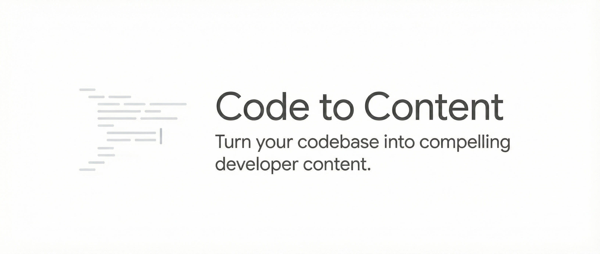

<p align="center">
  
</p>

<p align="center">
  <a href="https://github.com/arome3/code-to-content/blob/main/LICENSE">
    
  </a>
  <a href="https://github.com/arome3/code-to-content/issues">
    
  </a>
  <a href="https://twitter.com/arome_dev">
    
  </a>
</p>

# Code to Content

> *From commits to content.*

Transform codebases into compelling developer content with a mandatory 5-phase process, verification gates, and build-in-public support.

## Why Use This?

Most developers ship amazing code but struggle to tell the story.

* **Writer's Block:** Staring at a blank page is painful.
* **Context Switching:** Turning deep technical logic into accessible English is hard.
* **Consistency:** "Building in public" requires constant updates.

**Code to Content** solves this by using your **actual source code** as the source of truth. It doesn't just "write a generic post"—it analyzes your specific implementation, architectural decisions, and variable names to generate evidence-based content.

## What This Skill Does

| Feature | Description |
|---------|-------------|
| **5-Phase Process** | Mandatory workflow: Analysis → Audience → Content → Optimization → Verification |
| **Quick Mode** | Reduced-phase commands for rapid content generation |
| **Verification Gates** | Each phase has gates that MUST pass before proceeding |
| **9 Content Types** | Blog, tutorial, Twitter, LinkedIn, README, newsletter, video script, conference talk, product launch |
| **Build-in-Public** | Journey brief system for sustained narrative and voice continuity |
| **Claude-Native** | Zero dependencies — all analysis performed inline |
| **MCP Ready** | Optional integration with social MCP servers for direct posting |
| **18 Evaluation Questions** | Self-testing suite to verify skill effectiveness |

## Installation

### Option 1: Claude Code Plugin (Recommended)

```
/plugin marketplace add arome3/code-to-content
/plugin install code-to-content@arome3/code-to-content
```

Restart Claude Code after installation.

### Option 2: Clone to skills folder

```bash
git clone https://github.com/arome3/code-to-content /tmp/code-to-content
cp -r /tmp/code-to-content/skills/code-to-content ~/.claude/skills/
rm -rf /tmp/code-to-content
```

### Option 3: Copy to your project

```bash
# Clone and copy to your project's skills folder
git clone https://github.com/arome3/code-to-content /tmp/code-to-content
cp -r /tmp/code-to-content/skills/code-to-content your-project/.claude/skills/
rm -rf /tmp/code-to-content
```

## Quick Start

Once installed, the skill auto-activates when you ask Claude to create:
- Blog posts or tutorials about code
- README, changelog, or API docs
- Twitter/X threads or LinkedIn posts
- Conference talk proposals
- Build-in-public updates

### Example Usage

```
You: Write a blog post about my FastAPI project at ./src

Claude: [Executes 5-phase process]
  Phase 1: Analyzing codebase...
  Phase 2: Locking audience...
  Phase 3: Generating content...
  Phase 4: Optimizing...
  Phase 5: Verifying quality gates...

  [Delivers verified content]
```

<details>
<summary><b>See an example Blog Post output</b></summary>

> **Title:** How we reduced latency by 40% using Rust (and why we ditched Python)
>
> **Intro:**
> When we started the `payment-service` module (located in `/src/services/payments`), we hit a bottleneck. Our Python implementation was choking on concurrent requests.
>
> In this post, I'll show you exactly how we refactored the `AsyncProcessor` class...
>
> *[...Full post continues with code snippets extracted from your files...]*

</details>

### Slash Commands

**Full Mode (All 5 Phases)**

| Command | Description |
|---------|-------------|
| `/c2c:blog` | Generate a blog post |
| `/c2c:tutorial` | Generate a tutorial |
| `/c2c:twitter` | Generate a Twitter/X thread |
| `/c2c:readme` | Generate a README |
| `/c2c:linkedin` | Generate a LinkedIn post |
| `/c2c:newsletter` | Generate a newsletter issue |
| `/c2c:video-script` | Generate a video script |
| `/c2c:conference-talk` | Generate a CFP + talk outline |
| `/c2c:product-launch` | Generate multi-platform launch content |

**Quick Mode (Reduced Phases)**

| Command | Phases Skipped | Best For |
|---------|----------------|----------|
| `/c2c:quick-twitter` | 1, 2, 4 | Fast tweets when you know your audience |
| `/c2c:quick-linkedin` | 1, 2, 4 | Quick LinkedIn posts |
| `/c2c:quick-blog` | 1, 4 | Rapid blog drafts (still validates audience) |
| `/c2c:quick-readme` | 1, 2 | Fast README updates |

## What's Included

```
code-to-content/
├── .claude-plugin/
│   └── plugin.json             # Plugin metadata
├── skills/
│   └── code-to-content/
│       ├── SKILL.md            # Main skill definition (v1.0.0)
│       ├── .claude/commands/   # 13 slash commands (9 full + 4 quick)
│       ├── assets/templates/   # Content templates with copy-ready formats
│       ├── references/         # Claude-native analysis guides (13 files)
│       ├── examples/           # Positive, negative, workflow
│       ├── evaluation/         # 18 QA pairs
│       └── legacy/             # Archived Python scripts (optional)
├── README.md
└── LICENSE
```

## The 5-Phase Process

```
PHASE 1 ──[Gate]──> PHASE 2 ──[Gate]──> PHASE 3 ──[Gate]──> PHASE 4 ──[Gate]──> PHASE 5 ──[Gate]──> DELIVERY
```

| Phase | Purpose | Gate Requirement |
|-------|---------|------------------|
| **1. Analysis** | Understand the codebase | 3+ content angles found |
| **2. Audience** | Lock in ONE target audience | No audience mixing |
| **3. Content** | Generate evidence-based draft | All claims grounded |
| **4. Optimization** | Apply SEO, voice, visuals | Voice consistent |
| **5. Verification** | Quality gate checks | All thresholds pass |

## Build-in-Public Support

For sustained content creation, the skill includes a **Journey Brief** system:

- **Persistent context** across content sessions
- **Milestone-to-content mapping** (what to post when)
- **Voice continuity** checklists
- **Content cascade timing** (Twitter → LinkedIn → Blog → Newsletter)

See `references/build-in-public.md` for the full guide.

## Evaluation

Test skill effectiveness with 18 self-contained questions:

```bash
# In Claude Code with skill loaded
claude

# Ask any evaluation question, e.g.:
> According to SKILL.md, what is the maximum jargon density for intermediate developers?
# Expected: 4%
```

Categories tested:
- Template structure knowledge
- Audience profile thresholds
- Voice calibration rules
- Script capabilities
- Reference file content
- Content quality gates
- Build-in-public workflow

## Requirements

- **Claude Code** — No external dependencies required
- All analysis is performed inline using Claude-native protocols
- Optional: MCP servers for direct social media posting (see `references/mcp-integration.md`)

## Contributing

Contributions welcome! Please:
1. Fork the repository
2. Create a feature branch
3. Add/update evaluation questions if adding features
4. Submit a pull request

## License

MIT License — see [LICENSE](LICENSE) file.

---

## Author

[Abraham Onoja](https://github.com/arome3) · [@arome_dev](https://x.com/arome_dev)
