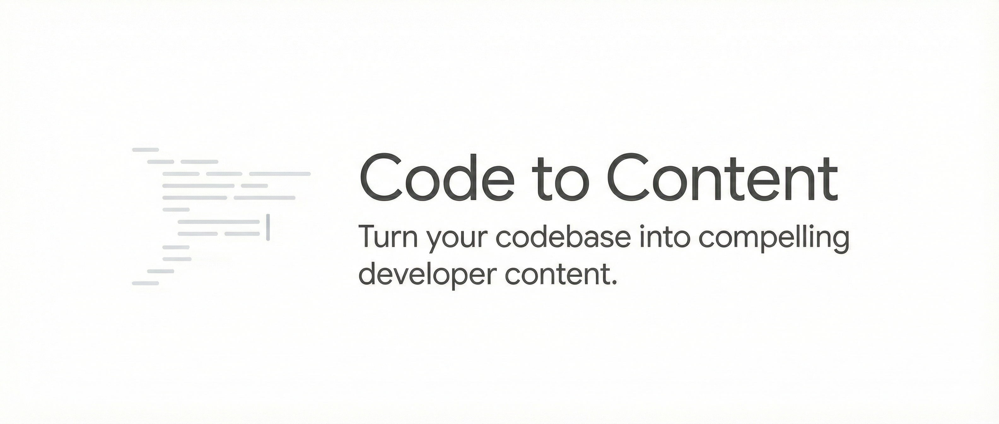

<p align="center">
  
</p>

<p align="center">
  <a href="https://github.com/arome3/code-to-content/blob/main/LICENSE">
    
  </a>
  <a href="https://github.com/arome3/code-to-content/issues">
    
  </a>
  <a href="https://twitter.com/arome_dev">
    
  </a>
</p>

# Code to Content

> *From commits to content.*

Transform codebases into compelling developer content with a mandatory 6-phase process, verification gates, and build-in-public support.

## Why Use This?

Most developers ship amazing code but struggle to tell the story.

* **Writer's Block:** Staring at a blank page is painful.
* **Context Switching:** Turning deep technical logic into accessible English is hard.
* **Consistency:** "Building in public" requires constant updates.

**Code to Content** solves this by using your **actual source code** as the source of truth. It doesn't just "write a generic post"—it analyzes your specific implementation, architectural decisions, and variable names to generate evidence-based content.

## What This Skill Does

| Feature | Description |
|---------|-------------|
| **6-Phase Process** | Mandatory workflow: Analysis → **Differentiation** → Audience → Content → Optimization → Verification |
| **Differentiation Engine** | Extracts the *why*, your opinion, and what you chose *not* to build — then runs the **swap-the-name test** so you never ship generic content |
| **Quick Mode** | Reduced-phase commands for rapid content generation |
| **Verification Gates** | Each phase has gates that MUST pass before proceeding |
| **9 Content Types** | Blog, tutorial, Twitter, LinkedIn, README, newsletter, video script, conference talk, product launch |
| **Build-in-Public** | Journey brief system for sustained narrative and voice continuity |
| **Claude-Native** | Zero dependencies — all analysis performed inline |
| **MCP Ready** | Optional integration with social MCP servers for direct posting |
| **25 Evaluation Questions** | Self-testing suite to verify skill effectiveness |

## Installation

### Option 1: Claude Code Plugin (Recommended)

```
/plugin marketplace add arome3/code-to-content
/plugin install code-to-content@code-to-content
```

Restart Claude Code after installation.

### Option 2: Clone to skills folder

```bash
git clone https://github.com/arome3/code-to-content /tmp/code-to-content
cp -r /tmp/code-to-content/skills/code-to-content ~/.claude/skills/
rm -rf /tmp/code-to-content
```

### Option 3: Copy to your project

```bash
# Clone and copy to your project's skills folder
git clone https://github.com/arome3/code-to-content /tmp/code-to-content
cp -r /tmp/code-to-content/skills/code-to-content your-project/.claude/skills/
rm -rf /tmp/code-to-content
```

## Quick Start

Once installed, the skill auto-activates when you ask Claude to create:
- Blog posts or tutorials about code
- README, changelog, or API docs
- Twitter/X threads or LinkedIn posts
- Conference talk proposals
- Build-in-public updates

### Example Usage

```
You: Write a blog post about my FastAPI project at ./src

Claude: [Executes 6-phase process]
  Phase 1: Analyzing codebase...
  Phase 2: Differentiation discovery (offer: the WHY, your opinion, roads not taken)...
  Phase 3: Locking audience...
  Phase 4: Generating content...
  Phase 5: Optimizing...
  Phase 6: Verifying quality gates + swap-the-name test...

  [Delivers verified content]
```

<details>
<summary><b>See an example Blog Post output</b></summary>

> **Title:** Why we rewrote our payment path in Rust — and the one service next door we deliberately left in Python
>
> **Intro (WHY-led, not a feature list):**
> Everyone says "rewrite the hot path in Rust" like it's free. It isn't — you trade a language your whole team knows for a latency win you have to earn. The bottleneck was real: `AsyncProcessor` in `payment-service` (`/src/services/payments`) was serializing under concurrent load, and we measured it.
>
> **The road we didn't take:** we *kept* the adjacent `reporting-service` in Python on purpose — it's batch, not hot, and the team velocity mattered more than the milliseconds.
>
> *[...continues with the trade-offs and code, grounded in your actual files — then a Phase 6 swap-the-name check confirms a competitor couldn't republish it...]*

</details>

### Slash Commands

**Full Mode (All 6 Phases)**

| Command | Description |
|---------|-------------|
| `/c2c:blog` | Generate a blog post |
| `/c2c:tutorial` | Generate a tutorial |
| `/c2c:twitter` | Generate a Twitter/X thread |
| `/c2c:readme` | Generate a README |
| `/c2c:linkedin` | Generate a LinkedIn post |
| `/c2c:newsletter` | Generate a newsletter issue |
| `/c2c:video-script` | Generate a video script |
| `/c2c:conference-talk` | Generate a CFP + talk outline |
| `/c2c:product-launch` | Generate multi-platform launch content |

**Quick Mode (Reduced Phases)**

| Command | Phases Skipped | Best For |
|---------|----------------|----------|
| `/c2c:quick-twitter` | 1, 2, 4 | Fast tweets when you know your audience |
| `/c2c:quick-linkedin` | 1, 2, 4 | Quick LinkedIn posts |
| `/c2c:quick-blog` | 1, 4 | Rapid blog drafts (still validates audience) |
| `/c2c:quick-readme` | 1, 2 | Fast README updates |

## What's Included

```
code-to-content/
├── .claude-plugin/
│   └── plugin.json             # Plugin metadata
├── skills/
│   └── code-to-content/
│       ├── SKILL.md            # Main skill definition (v1.1.0)
│       ├── .claude/commands/   # 14 slash commands (9 full + 4 quick + cascade)
│       ├── assets/templates/   # Content templates with copy-ready formats
│       ├── references/         # Claude-native analysis guides (14 files, incl. differentiation.md)
│       ├── examples/           # Positive, negative, differentiation, workflow
│       ├── evaluation/         # 25 QA pairs
│       └── legacy/             # Archived Python scripts (optional)
├── README.md
└── LICENSE
```

## The Differentiation Engine

AI made competent prose free, so *grounded but generic* now gets ignored — cover the logo, swap in a competitor's name, and most "We're excited to announce…" posts read identically. **v1.1.0** adds the layer that fixes this:

- **Lead with the WHY**, not a feature list — the thesis your work is a consequence of.
- **Hold one defensible opinion** you'd stand behind, instead of committee-hedged mush.
- **Show what you chose *not* to build** — the trade-offs and rejected paths only you know.

Phase 2 gathers this from you — a short interview, raw material (Slack threads, notes, a voice-memo transcript), or a rough draft to polish ("mess over spec"). Phase 6 then scores the result **0–5** and runs the **swap-the-name test**. It never blocks you; it just refuses to pretend code-only output is distinctive, flagging it `AT RISK` instead. See `references/differentiation.md`.

## The 6-Phase Process

```
P1 ─[Gate]→ P2 ─[Gate*]→ P3 ─[Gate]→ P4 ─[Gate]→ P5 ─[Gate]→ P6 ─[Gate]→ DELIVERY
```

| Phase | Purpose | Gate Requirement |
|-------|---------|------------------|
| **1. Code Analysis** | Understand the codebase | 3+ content angles found |
| **2. Differentiation Discovery** | Get the *why*, your opinion, the roads not taken | Forecast set: on-track / at-risk* |
| **3. Audience** | Lock in ONE target audience | No audience mixing |
| **4. Content** | Generate evidence-based, WHY-led draft | All claims grounded |
| **5. Optimization** | Apply SEO, voice, visuals | Voice consistent |
| **6. Verification** | Quality gates + swap-the-name distinctiveness check | Thresholds pass; distinctiveness reported |

<sub>*Phase 2's gate is **soft** — it never blocks delivery. Decline the interview and the skill proceeds on code alone, flagging the result distinctiveness `AT RISK`.</sub>

## Build-in-Public Support

For sustained content creation, the skill includes a **Journey Brief** system:

- **Persistent context** across content sessions
- **Milestone-to-content mapping** (what to post when)
- **Voice continuity** checklists
- **Content cascade timing** (Twitter → LinkedIn → Blog → Newsletter)

See `references/build-in-public.md` for the full guide.

## Evaluation

Test skill effectiveness with 25 self-contained questions:

```bash
# In Claude Code with skill loaded
claude

# Ask any evaluation question, e.g.:
> According to SKILL.md, what is the maximum jargon density for intermediate developers?
# Expected: 4%
```

Categories tested:
- Template structure knowledge
- Audience profile thresholds
- Voice calibration rules
- Script capabilities
- Reference file content
- Content quality gates
- Differentiation (Phase 2 + swap-the-name test)
- Build-in-public workflow

## Requirements

- **Claude Code** — No external dependencies required
- All analysis is performed inline using Claude-native protocols
- Optional: MCP servers for direct social media posting (see `references/mcp-integration.md`)

## Contributing

Contributions welcome! Please:
1. Fork the repository
2. Create a feature branch
3. Add/update evaluation questions if adding features
4. Submit a pull request

## License

MIT License — see [LICENSE](LICENSE) file.

---

## Author

[Abraham Onoja](https://github.com/arome3) · [@arome_dev](https://x.com/arome_dev)
