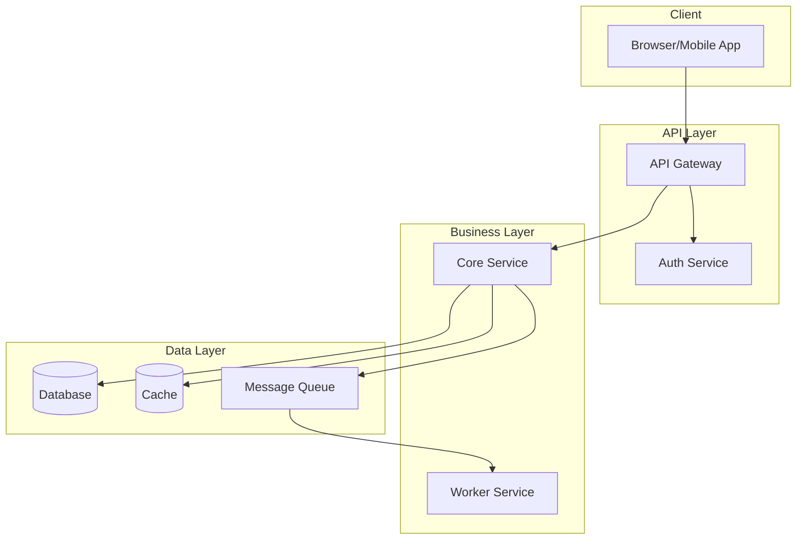
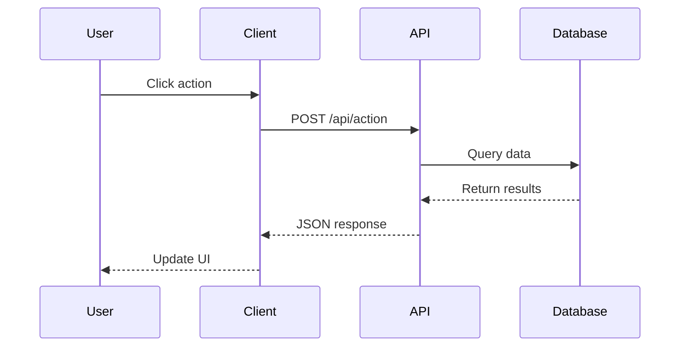
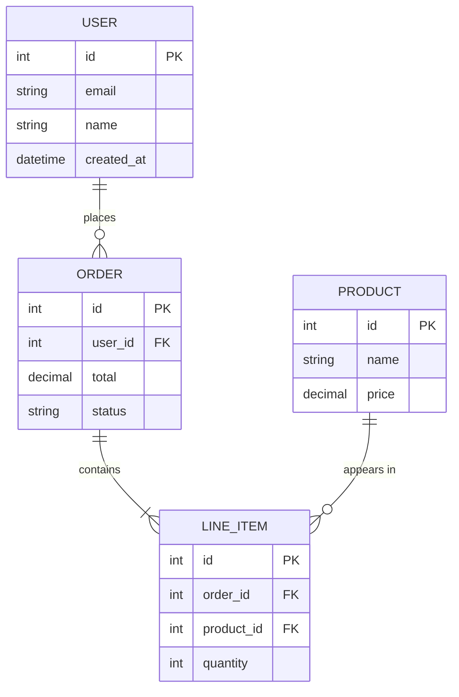
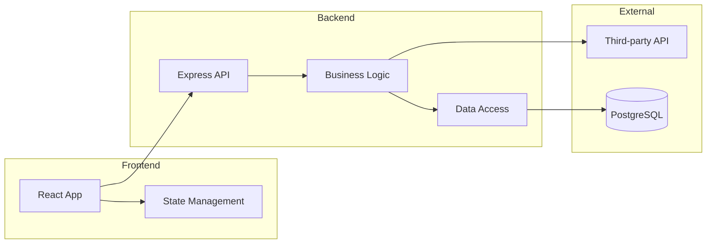
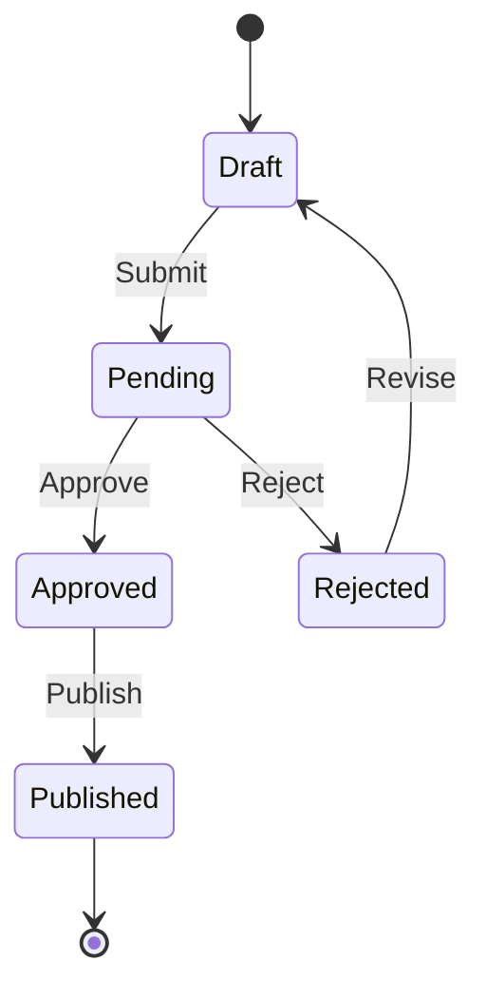
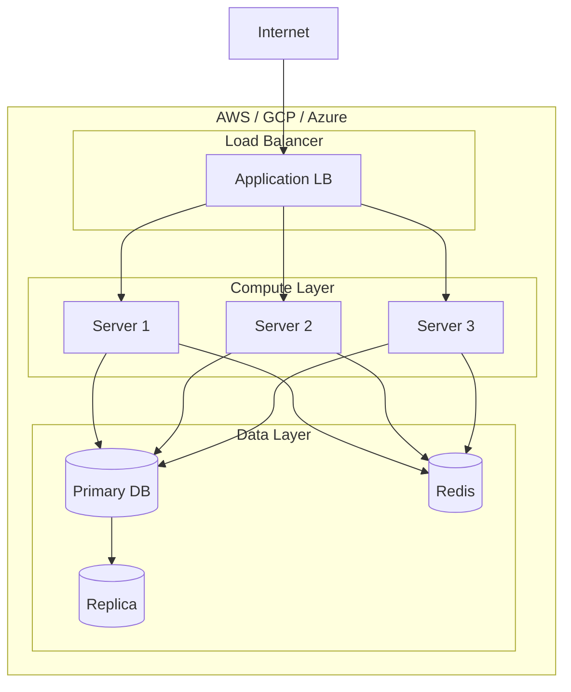

# Diagram Templates

Claude-native replacement for `generate_diagrams.py`. Use these templates to create architecture diagrams in Mermaid or ASCII format.

---

## When to Use Diagrams

Add diagrams when:
- Explaining system architecture (3+ components)
- Showing data flow between services
- Documenting API request/response cycles
- Visualizing database relationships
- Illustrating deployment topology

---

## Mermaid Diagram Templates

### 1. Architecture Diagram (Flowchart)

For showing system components and their relationships:



**Customization:**
- Replace component names with actual service names
- Add/remove subgraphs based on actual architecture
- Use shapes: `[Rectangle]`, `(Rounded)`, `[(Database)]`, `{Diamond}`

### 2. Sequence Diagram

For showing request/response flows:



**Customization:**
- `->>`  solid arrow (request)
- `-->>` dotted arrow (response)
- Add `Note over A,D: Description` for annotations
- Use `activate/deactivate` for long operations

### 3. Entity-Relationship Diagram

For documenting database schema:



**Relationship notation:**
- `||--||` one to one
- `||--o{` one to many
- `o{--o{` many to many
- `||--|{` one to one or more

### 4. Component Diagram

For showing module dependencies:



### 5. State Diagram

For documenting state machines or workflows:



### 6. Deployment Diagram

For infrastructure documentation:



---

## ASCII Diagram Templates

For environments where Mermaid isn't supported:

### Simple Architecture

```
┌─────────────────────────────────────────────────────┐
│                      CLIENT                          │
│  ┌─────────────┐    ┌─────────────┐                 │
│  │   Browser   │    │  Mobile App │                 │
│  └──────┬──────┘    └──────┬──────┘                 │
└─────────┼──────────────────┼────────────────────────┘
          │                  │
          ▼                  ▼
┌─────────────────────────────────────────────────────┐
│                    API GATEWAY                       │
└──────────────────────┬──────────────────────────────┘
                       │
       ┌───────────────┼───────────────┐
       ▼               ▼               ▼
┌─────────────┐ ┌─────────────┐ ┌─────────────┐
│   Auth      │ │   Users     │ │   Orders    │
│   Service   │ │   Service   │ │   Service   │
└──────┬──────┘ └──────┬──────┘ └──────┬──────┘
       │               │               │
       └───────────────┼───────────────┘
                       ▼
              ┌─────────────────┐
              │    Database     │
              └─────────────────┘
```

### Request Flow

```
  User         Client          API           Database
   │              │              │               │
   │  Click       │              │               │
   │─────────────>│              │               │
   │              │  POST /api   │               │
   │              │─────────────>│               │
   │              │              │  Query        │
   │              │              │──────────────>│
   │              │              │               │
   │              │              │  Results      │
   │              │              │<──────────────│
   │              │  Response    │               │
   │              │<─────────────│               │
   │  Update UI   │              │               │
   │<─────────────│              │               │
```

### Directory Tree

```
project/
├── src/
│   ├── components/
│   │   ├── Button.tsx
│   │   ├── Card.tsx
│   │   └── index.ts
│   ├── services/
│   │   ├── api.ts
│   │   └── auth.ts
│   ├── utils/
│   │   └── helpers.ts
│   └── index.ts
├── tests/
│   └── components/
├── package.json
└── README.md
```

---

## Diagram Generation Protocol

When asked to create a diagram:

### Step 1: Identify the Purpose
- **Architecture overview:** Use flowchart with subgraphs
- **API flow:** Use sequence diagram
- **Database schema:** Use ER diagram
- **State/workflow:** Use state diagram
- **Module deps:** Use component diagram

### Step 2: Gather Information
Read relevant files:
- `package.json` → dependencies and scripts
- Directory structure → component organization
- API routes → endpoint relationships
- Database models → entity relationships

### Step 3: Choose Format
- **Mermaid:** For documentation platforms (GitHub, Notion, Docusaurus)
- **ASCII:** For plain text (README, comments, terminals)
- **Both:** When unsure of rendering environment

### Step 4: Generate and Validate
- Start simple, add detail incrementally
- Validate Mermaid syntax renders correctly
- Ensure ASCII alignment is preserved

---

## Common Diagram Patterns by Project Type

### REST API Project
1. Sequence diagram: Request lifecycle
2. ER diagram: Data models
3. Flowchart: Authentication flow

### Microservices Project
1. Architecture diagram: Service topology
2. Sequence diagram: Inter-service communication
3. Deployment diagram: Infrastructure layout

### Frontend Application
1. Component diagram: React/Vue component tree
2. State diagram: State management flow
3. Flowchart: User journey

### CLI Tool
1. Flowchart: Command execution flow
2. State diagram: Tool states
3. Architecture diagram: Module organization

---

## Decision Criteria: When to Include Visuals

### Always Create Diagrams For

- Architecture explanations (3+ components)
- Multi-step processes or workflows
- Data flow between components
- State transitions and lifecycle events
- Request/response sequences
- Database relationships
- Decision trees and conditional logic

### Skip Visuals When

- Concept is simple enough for prose
- Content is purely reference (API lists, config options)
- Visual would merely decorate without clarifying
- Single component with no relationships

---

## Code Illustration Guidelines

When illustrating code concepts:

### For Architecture
- Show component boundaries clearly
- Indicate data flow direction with arrows
- Label protocols/formats (HTTP, JSON, gRPC)
- Include relevant ports/endpoints

### For Data Flow
- Start from trigger/input
- Show transformations at each step
- End at final destination/output
- Include error paths when relevant

### For Processes
- Number sequential steps
- Show decision points clearly
- Include success and failure paths
- Indicate async vs sync operations

---

## Accessibility Requirements

Generate alt text for EVERY diagram using this format:

```
[Diagram type]: [What it shows]. [Key relationships or flow].
```

### Examples

```
"Flowchart: User authentication flow. Shows login validation
leading to either dashboard access or error handling."

"Architecture diagram: Three-tier system with React frontend
connecting to Node.js API backed by PostgreSQL database."

"Sequence diagram: Order creation process showing client,
API, payment service, and database interactions."
```

### Color Accessibility
- Never use color as the only differentiator
- Ensure text is readable in both light and dark modes
- Use patterns or labels in addition to colors

---

## Platform-Specific Formatting

### GitHub README
- Use Mermaid (natively supported)
- ASCII as fallback for complex diagrams
- Keep diagrams under 1000px wide

### Documentation Sites (Docusaurus, GitBook)
- Mermaid with full features
- Include both diagram and text explanation
- Link to editable source when appropriate

### Blog Posts
- Mermaid or ASCII depending on platform support
- Consider exportable image versions
- Keep mobile readability in mind

### Terminal/CLI Docs
- ASCII only (guaranteed rendering)
- Test at 80-character width
- Use basic ASCII characters for maximum compatibility

---

## Diagram Formatting Rules

### Structure
- One concept per diagram
- Maximum 7-9 elements per diagram
- Left-to-right or top-to-bottom flow
- Consistent spacing and alignment

### Labels
- Clear, descriptive node names
- Action verbs on arrows
- Brief annotations where needed
- No abbreviations unless standard

### Complexity Management
- Split large diagrams into multiple focused diagrams
- Reference other diagrams when needed
- Use zoom levels (overview → detail)

---

## Anti-Patterns to Avoid

| Avoid | Instead |
|-------|---------|
| Diagram without clear purpose | Only diagram when it aids understanding |
| Too many elements (10+) | Split into focused sub-diagrams |
| Unclear labels or abbreviations | Use full, descriptive names |
| Missing alt text | Always provide text descriptions |
| Decorative-only visuals | Every diagram must convey information |
| Platform-incompatible format | Check rendering support before choosing format |
| Color-only differentiation | Use patterns, labels, or shapes alongside color |

---

## Pre-Delivery Checklist

Before including any diagram:

### Necessity
- [ ] Does this visual clarify something prose cannot?
- [ ] Is the complexity level appropriate?
- [ ] Will the target platform render it correctly?

### Quality
- [ ] Labels are clear and complete
- [ ] Flow direction is logical
- [ ] No more than 7-9 elements
- [ ] Spacing is consistent

### Accessibility
- [ ] Alt text is written
- [ ] Color is not the only differentiator
- [ ] Text is readable
- [ ] Works in light and dark modes
