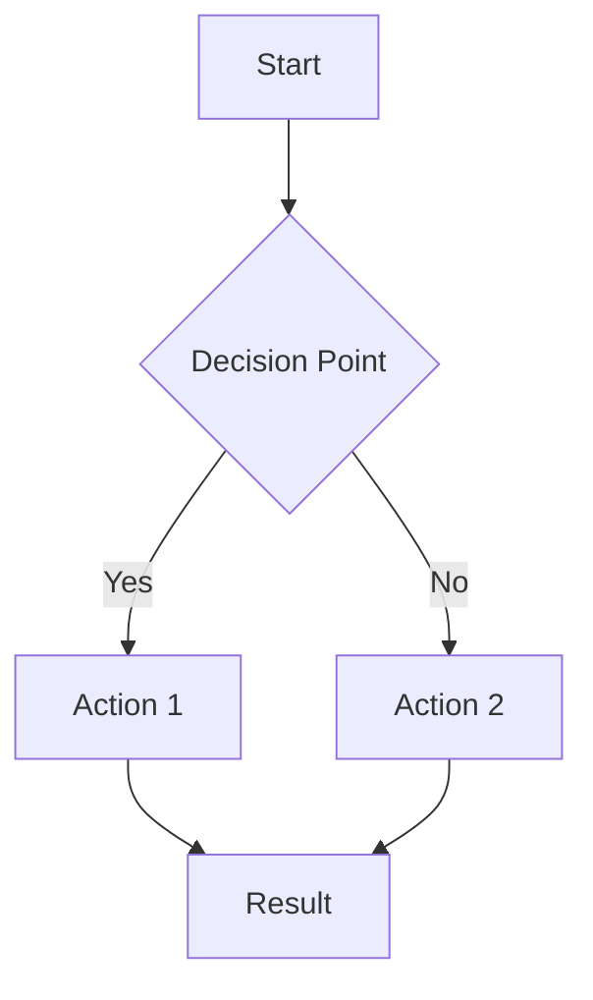
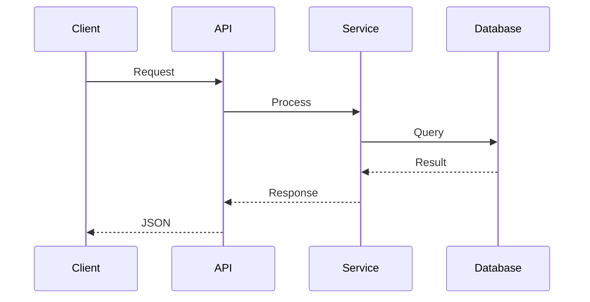
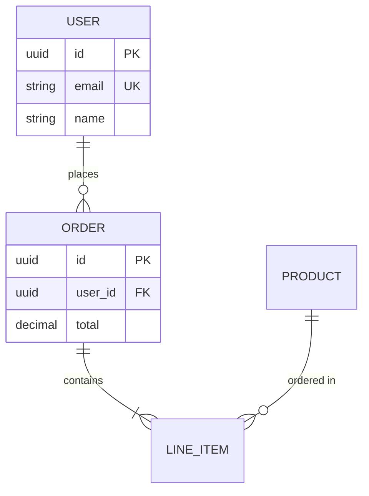
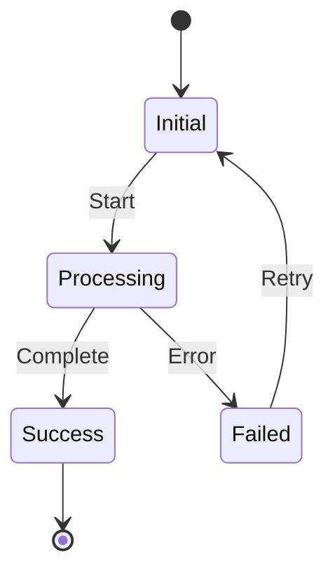
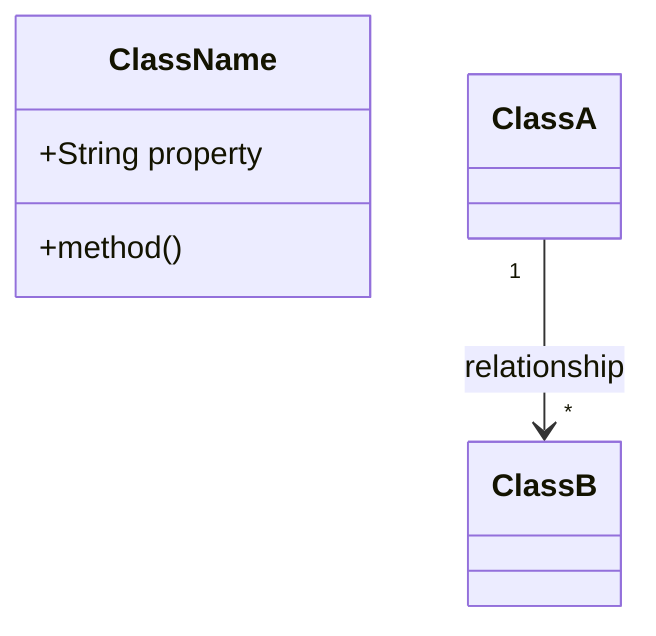

# Content Optimization Techniques

Reference for optimization techniques applied during content generation. Each section covers a specific optimization dimension.

---

## Storytelling

### Core Principle

Derive all narrative elements from actual project data. Never invent scenarios.

**Source Priority:**
1. Git history (commits, diffs, timelines)
2. TODOs and FIXMEs in code
3. Architecture decisions visible in structure
4. Dependency files and configuration
5. Code patterns and complexity metrics

### Story Element Extraction

**From Git History:**
- Identify largest commits by file changes
- Read commit messages for emotional language ("finally", "at last", "breaking change")
- Capture before/after state from diffs
- Note timeline between key commits

**From TODOs and FIXMEs:**
- Locate all TODO/FIXME comments
- Determine age from git blame
- Categorize: bug, hack, performance, security, refactor
- Identify which remain unresolved

### Narrative Arc Structure

```
1. THE HOOK
   - Open with specific, verifiable moment from project
   - Use actual commit messages, dates, or metrics

2. THE CONTEXT
   - Describe "before" state using git history evidence
   - Quote actual code showing old approach

3. THE TURNING POINT
   - Identify commit/change marking transformation
   - Reference actual dates and file changes

4. THE RESOLUTION
   - Present "after" state with current code evidence
   - Quantify improvements where metrics exist

5. THE LESSON
   - Extract pattern from specific change
   - Keep grounded in project reality
```

### Commit Message Interpretation

| Pattern | Story Type |
|---------|------------|
| "finally", "at last" | Long struggle resolved |
| "revert", "rollback" | Failed experiment |
| "fix", "hotfix" | Debug detective story |
| "refactor", "cleanup" | Technical debt payoff |
| "breaking change" | Bold transformation |

### When to Apply

**Use storytelling when:**
- Content explains transformation or evolution
- Content addresses challenge or complexity
- Content justifies decision or choice
- Project history provides compelling evidence

**Skip storytelling when:**
- Content is purely reference/API documentation
- Direct instruction more appropriate
- No meaningful narrative arc exists
- Brevity is priority

---

## Cognitive Load

### Calibrate by Complexity

**Low complexity** (score 1-3, deps < 10):
- Combine concept and implementation in single pass
- Skip scaffolding analogies
- Proceed directly to practical usage

**Medium complexity** (score 4-6, deps 10-30):
- Present concept first, then implementation
- Group related ideas into clusters
- Include analogies for unfamiliar patterns only

**High complexity** (score 7-10, deps > 30):
- Multi-layer progressive disclosure
- Decompose into prerequisite chains
- Insert checkpoint summaries after major topics
- Build mental models before implementation

### Prerequisite Analysis

**Step 1: Classify dependencies**
- Runtime frameworks (React, Django) = Conceptual familiarity
- Build tools (Webpack, Vite) = Awareness only
- Type systems (TypeScript) = Affects code presentation
- Domain libraries (Prisma, TensorFlow) = Core prerequisite
- Utility libraries (lodash) = No prerequisite needed

**Step 2: Produce three lists**
- "Must understand" = Blocking prerequisites
- "Helpful to know" = Accelerates understanding
- "Will be explained" = Covered in content

### Sequence by Architecture

**Layered (Controllers, Services, Repositories):**
1. Data models → 2. Repository → 3. Service → 4. Controller

**Microservices:**
1. Service boundaries → 2. Communication → 3. Representative service → 4. Cross-cutting

**Event-driven:**
1. Event catalog → 2. Producers → 3. Consumers → 4. Complete flow trace

**Monolithic/MVC:**
1. Request lifecycle → 2. Model → 3. Controller → 4. View

### Progressive Disclosure Layers

| Layer | Content | Treatment |
|-------|---------|-----------|
| Foundation | Core utilities, shared types | Explain fully first |
| Domain | Models, business entities | Explain when needed |
| Application | Services, API handlers | Full explanation with examples |
| Advanced | Middleware, plugins | Mark optional, explain when relevant |
| Reference | Config, tests, scripts | Point to, don't detail |

### Working Memory Constraints

- Maximum 4 files/concepts per cluster
- One concept cluster = one major section
- Never split cluster across sections
- If cluster > 4 files, identify "core" vs "supporting"

### Complexity Signals

| Complexity | Label | Time | Notes |
|------------|-------|------|-------|
| Simple | "Quick concept" | ~5 min | Small files, few imports |
| Moderate | "Core concept" | ~15 min | Standard patterns |
| Complex | "Deep dive" | ~30+ min | List prerequisites |

### Comprehension Checkpoints

Place after:
- Each concept cluster
- Each architecture layer
- Before new subsystem
- After complex sections

Include:
1. Summary of concepts covered
2. Connection to next section
3. Verification questions
4. Exploration task

---

## SEO

### Keyword Extraction

**From package.json / requirements.txt:**
- Technology names from `dependencies` = Core keywords
- Tool names from `devDependencies` = Secondary keywords
- Name/description fields = Project identity terms

**From Directory Structure:**
```
src/auth/          → "authentication", "authorization"
src/payments/      → "payment processing", "checkout"
src/notifications/ → "real-time", "messaging"
src/ml/            → "machine learning", "AI"
src/api/graphql/   → "GraphQL", "API design"
```

### Keyword Combinations

```
Primary:
- {{framework}} + {{version}} + {{problem_domain}}
- {{framework}} + {{secondary_tech}}
- {{problem_domain}} + {{unique_approach}}

Stack (lower competition):
- {{framework}} + {{library_1}} + {{library_2}}
- {{framework}} + {{version}} + {{feature}}
```

### Title Templates

**Tutorials:**
```
"How to Build {{problem_domain}} with {{framework}} {{version}}"
"{{framework}} {{problem_domain}} Tutorial: {{unique_approach}}"
```

**Deep Dives:**
```
"{{framework}} {{feature}}: {{problem_domain}} Implementation"
"Understanding {{concept}} in {{framework}} {{version}}"
```

**Troubleshooting:**
```
"{{common_error}} in {{framework}}: {{solution_summary}}"
"Fixing {{problem}} with {{secondary_tech}} in {{framework}}"
```

### Meta Description Structure

```
[Problem/Question] + [What project demonstrates] + [What reader learns]
```

**Requirements:**
- 150-160 characters
- Include primary keyword naturally
- Reference project context
- End with value proposition

### Content Positioning

**High novelty projects:**
- Lead with "first look" framing
- Target "[new feature] tutorial" keywords
- Position as early adopter content

**Common problem projects:**
- Differentiate through depth
- Target underserved angles
- Add unique implementation perspective

### Version-Specific Optimization

Include version when:
- Framework version < 6 months old
- Version introduced significant changes
- Project uses version-specific features

### Verification Checklist

- [ ] Title contains primary keyword
- [ ] Title under 60 characters
- [ ] Meta description 150-160 characters
- [ ] H2 headings target secondary keywords
- [ ] Keywords appear in first paragraph
- [ ] Code examples from actual codebase
- [ ] Technology versions match dependencies

---

## Brand Voice

### Voice Calibration Sequence

**Step 1: Extract signals from codebase**
```
tech_stack       → Languages, frameworks, tools
code_style       → Naming conventions, structure
comment_style    → Documentation voice in code
project_type     → Library, application, CLI, SDK
maturity         → Version number, API stability
domain           → Problem space (fintech, devtools)
target_users     → Inferred from complexity
```

**Step 2: Set base voice from tech stack**

| Stack | Voice Characteristics |
|-------|----------------------|
| Rust | Precise, correctness-focused, safety-conscious |
| JavaScript/TypeScript | Pragmatic, ship-oriented, conversational |
| Python | Clear, accessible, explanatory |
| Go | Direct, minimal, no-nonsense |
| Java/Kotlin | Formal, thorough, pattern-aware |
| Infrastructure | Practical, cautious, operational |

**Step 3: Adjust for audience**

| Project Signals | Apply |
|-----------------|-------|
| Minimal deps + clear API | Accessible language, define terms |
| Complex types + patterns | Assume fundamentals, focus on nuance |
| Domain-specific jargon | Domain terms OK, explain tech only |
| Framework internals | Deep technical detail permitted |

### Calibrate by Maturity

| Version | Confidence | Language |
|---------|------------|----------|
| v0.x | Low | "might", "consider", "currently" |
| v1.x | Moderate | "should", "recommended", "typically" |
| v2.x+ | High | "use", "do", "the pattern for" |

### Domain Adjustments

| Domain | Apply |
|--------|-------|
| Fintech | Precise language, acknowledge compliance |
| Healthcare | Thorough, document edge cases |
| Developer Tools | Empathy for pain points |
| Enterprise | Address organizational concerns |
| Open Source | Welcome contribution, inclusive |

### Project Type Voice

| Type | Focus |
|------|-------|
| Library | API clarity, examples, integration |
| Application | User tasks, benefits, workflows |
| Infrastructure | Operations, failure modes, safety |
| CLI Tool | Scannability, flags, composition |
| SDK | Authentication, error handling |

### Voice Spectrums

```
FORMALITY:     Formal ←————→ Casual     (tech stack + domain)
DENSITY:       Dense ←————→ Accessible  (audience expertise)
PRESCRIPTIVE:  Hedging ←————→ Direct    (maturity)
OPINION:       Reserved ←————→ Strong   (project type)
```

---

## Visual Assets

### When to Create Diagrams

**Always diagram:**
- Architecture (system design, components)
- Multi-step processes
- Data flow between components
- State transitions
- Request/response sequences
- Database relationships

**Skip diagrams when:**
- Concept simple enough for prose
- Content purely reference
- Visual would merely decorate

### ASCII Diagrams

Use for: README files, code docs, terminal readers, guaranteed rendering

**Building Blocks:**
```
┌─────────────┐    +-------------+
│ Unicode Box │    | ASCII Basic |
└─────────────┘    +-------------+

Arrows: ──► ◄── │ ▼ ▲  (Unicode)
        --> <-- | v ^  (ASCII)
```

**Flow Patterns:**
```
A ──────► B ──────► C       Linear

    ┌──► B
A ──┤                       Branch
    └──► C

A ──► B ──► C               Cycle
▲         │
└─────────┘
```

**Layered Architecture:**
```
┌─────────────────────────────────────────────────┐
│                   PRESENTATION                   │
│  ┌──────────┐  ┌──────────┐  ┌──────────┐       │
│  │   Web    │  │  Mobile  │  │   CLI    │       │
│  └────┬─────┘  └────┬─────┘  └────┬─────┘       │
└───────┼─────────────┼─────────────┼─────────────┘
        │             │             │
        └─────────────┼─────────────┘
                      ▼
┌─────────────────────────────────────────────────┐
│                    SERVICES                      │
│  ┌──────────┐  ┌──────────┐  ┌──────────┐       │
│  │  Auth    │  │  Core    │  │  Data    │       │
│  └────┬─────┘  └────┬─────┘  └────┬─────┘       │
└───────┼─────────────┼─────────────┼─────────────┘
        │             │             │
        └─────────────┼─────────────┘
                      ▼
┌─────────────────────────────────────────────────┐
│                     DATA                         │
│  ┌──────────┐  ┌──────────┐  ┌──────────┐       │
│  │ Database │  │  Cache   │  │ Storage  │       │
│  └──────────┘  └──────────┘  └──────────┘       │
└─────────────────────────────────────────────────┘
```

**Service Communication:**
```
                    ┌─────────┐
                    │   API   │
                    │ Gateway │
                    └────┬────┘
                         │
         ┌───────────────┼───────────────┐
         ▼               ▼               ▼
    ┌─────────┐    ┌─────────┐    ┌─────────┐
    │Service A│    │Service B│    │Service C│
    └────┬────┘    └────┬────┘    └────┬────┘
         │              │              │
         ▼              ▼              ▼
    ┌─────────┐    ┌─────────┐    ┌─────────┐
    │  DB A   │    │  DB B   │    │  DB C   │
    └─────────┘    └─────────┘    └─────────┘
```

**Request Flow:**
```
Client          Server          Database
  │                │                │
  │───── GET ─────►│                │
  │                │──── SELECT ───►│
  │                │◄─── rows ──────│
  │◄─── JSON ──────│                │
  │                │                │
```

### Mermaid Diagrams

Use when: Platform supports rendering (GitHub, GitLab), consistent styling needed

**Flowchart:**


**Node Syntax Reference:**
```
A[Rectangle]           Default box
B(Rounded)            Rounded corners
C([Stadium])          Pill shape
D[(Database)]         Cylinder
E{Diamond}            Decision
F((Circle))           Circle
```

**Arrow Syntax:**
```
--> Solid arrow
--- Solid line
-.-> Dotted arrow
==> Thick arrow
--text--> Arrow with label
```

**Sequence Diagram:**


**Sequence Arrow Types:**
```
->>     Solid arrow (request)
-->>    Dashed arrow (response)
-x      Solid with X (async)
```

**Sequence Features:**
```
activate S          Show activation bar
deactivate S        End activation bar
Note over A,B: text Note spanning participants
loop Description    Loop block
alt Description     Alternative paths
```

**ER Diagram:**


**ER Relationship Notation:**
```
||--o{    One to many
||--|{    One to many (required)
}o--o{    Many to many
||--||    One to one
```

**State Diagram:**


**Class Diagram:**


### Diagram Selection

| Content | Diagram Type |
|---------|--------------|
| System overview | Context diagram (ASCII or Mermaid C4) |
| Component relationships | Architecture diagram (ASCII boxes) |
| API interactions | Sequence diagram (Mermaid) |
| Data models | ER diagram (Mermaid) |
| Workflow/process | Flowchart (Mermaid) |
| State machine | State diagram (Mermaid) |
| Code structure | Class diagram (Mermaid) |
| Decision logic | Flowchart with decision nodes |

### Code Illustration Guidelines

```
FOR ARCHITECTURE:
- Show component boundaries
- Indicate data flow direction
- Label protocols/formats (HTTP, JSON, gRPC)
- Include relevant ports/endpoints

FOR DATA FLOW:
- Start from trigger/input
- Show transformations at each step
- End at final destination/output
- Include error paths when relevant

FOR PROCESSES:
- Number sequential steps
- Show decision points clearly
- Include success and failure paths
- Indicate async vs sync operations
```

### Formatting Rules

- One concept per diagram
- Maximum 7-9 elements
- Left-to-right or top-to-bottom flow
- Clear, descriptive labels
- Action verbs on arrows
- Split large diagrams into focused sub-diagrams

### Accessibility

**Alt text format:**
```
[Diagram type]: [What it shows]. [Key relationships].
```

**Examples:**
```
"Flowchart: User authentication flow. Shows login validation
leading to either dashboard access or error handling."

"Architecture diagram: Three-tier system with React frontend
connecting to Node.js API backed by PostgreSQL database."

"Sequence diagram: Order creation process showing client,
API, payment service, and database interactions."
```

### Platform Formatting

| Platform | Format |
|----------|--------|
| GitHub README | Mermaid (native), ASCII fallback |
| Documentation sites | Mermaid with full features |
| Blog posts | Platform-dependent |
| Terminal/CLI docs | ASCII only (80-char width) |

### Anti-Patterns to Avoid

| Avoid | Instead |
|-------|---------|
| Diagram without clear purpose | Only diagram when it aids understanding |
| Too many elements (10+) | Split into focused sub-diagrams |
| Unclear labels or abbreviations | Use full, descriptive names |
| Missing alt text | Always provide text descriptions |
| Decorative-only visuals | Every diagram must convey information |
| Platform-incompatible format | Check rendering support first |

### Generation Checklist

```
NECESSITY:
□ Does this visual clarify something prose cannot?
□ Is the complexity level appropriate?
□ Will the target platform render it correctly?

QUALITY:
□ Labels are clear and complete
□ Flow direction is logical
□ No more than 7-9 elements
□ Spacing is consistent

ACCESSIBILITY:
□ Alt text is written
□ Color is not the only differentiator
□ Text is readable
□ Works in light and dark modes
```
